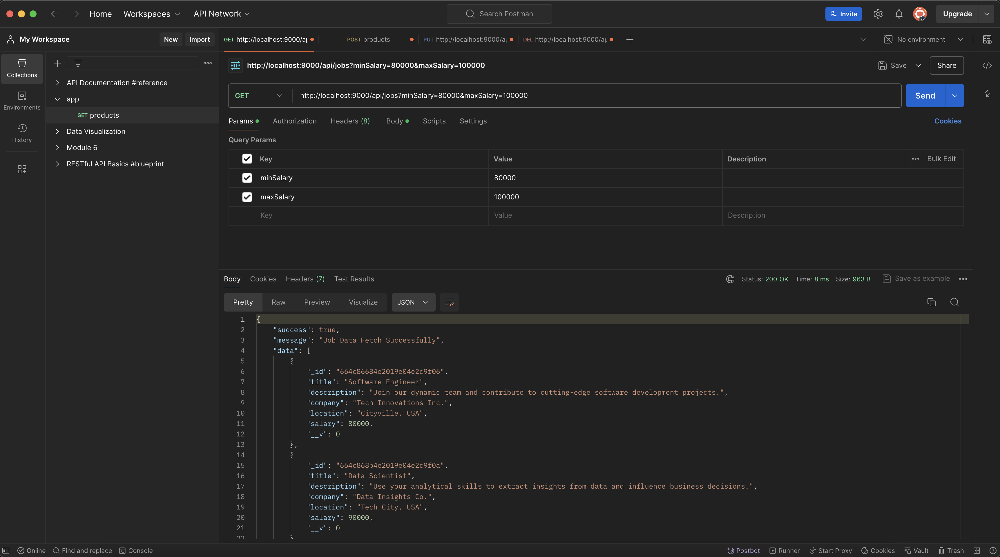
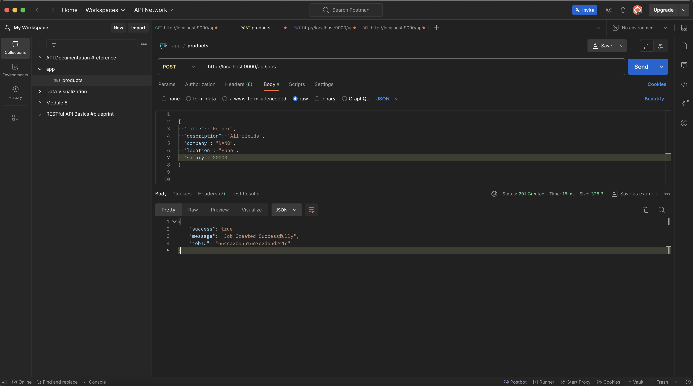
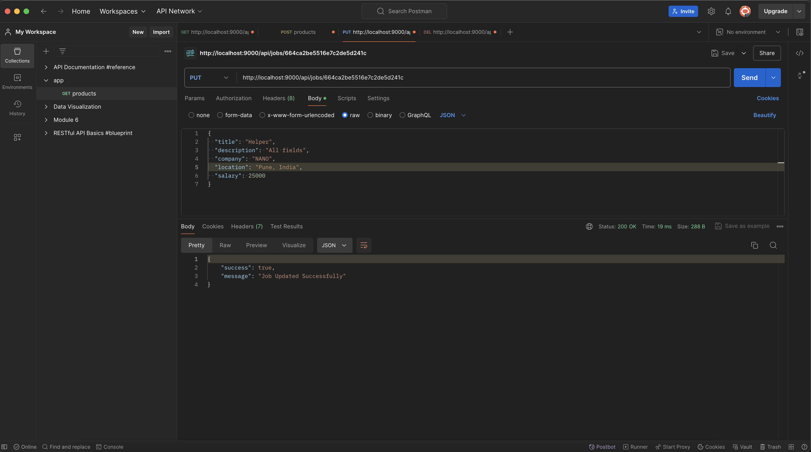
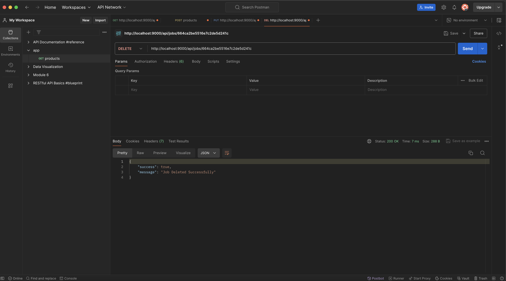

# Job Posting Application

## Overview
The Job Posting Application is a simple web application built with Node.js, Express.js, and MongoDB. It allows users to create, read, update, and delete job postings. This document provides an overview of the application's structure, setup instructions, and usage.

## Postman Screenshorts

#### Get Method


#### Post Method


#### Put Method


#### Delete Method


## Features

- Create a new job posting

- List all job postings with optional salary range filtering

- Edit an existing job posting

- Delete a job posting

## Project Structure

```go
job-posting-app/
├── controllers/
│   └── jobs.js
├── models/
│   └── jobs.js
├── routes/
│   └── jobs.js
├── app.js
└── package.json
```

## File Descriptions

- `app.js`: Main application file that sets up the server and connects to MongoDB.

- `controllers/jobs.js`: Contains the logic for handling job postings (create, read, update, delete).

- `models/jobs.js`: Defines the Mongoose schema and model for a job posting.

- `routes/jobs.js`: Defines the API routes for job postings.

- `package.json`: Contains the project dependencies and scripts.

## Setup Instructions

### Prerequisites

- Node.js and npm installed

- MongoDB installed and running locally

### Installation

1. Clone the repository:
```sh
git clone https://github.com/Lovenoelkujur/job-posting-application.git
cd job-posting-app
```
2. Install the dependencies:
```sh
npm install
```

## Configuration

No additional configuration is required for the default setup. The application connects to a MongoDB instance running locally at mongodb://localhost:27017/jobapp.

## Running the Application

Start the application using the following command:
```sh
npm start
```
The server will be running at `http://localhost:10000.`

## All the 4 Api Link (Render-Deployement)
1. `POST`
```bash
https://job-posting-application-1c1o.onrender.com/api/jobs
```

2. `GET`
```bash
https://job-posting-application-1c1o.onrender.com/api/jobs?minSalary=40000&maxSalary=100000
```

3. `PUT`
```bash
https://job-posting-application-1c1o.onrender.com/api/jobs/664ef1935402a50bd3794c17
```

4. `DELETE`
```bash
https://job-posting-application-1c1o.onrender.com/api/jobs/664ef1935402a50bd3794c17
```


## API Endpoints

### Create a Job

- URL: `/api/jobs`
- Method: `POST`
- Body Parameters:
```json
{
  "title": "Job Title",
  "description": "Job Description",
  "company": "Company Name",
  "location": "Job Location",
  "salary": 50000
}
```

- Response:
```json
{
  "success": true,
  "message": "Job Created Successfully",
  "jobId": "jobId"
}
```

### List Jobs

- URL: `/api/jobs`

- Method: `GET`

- Query Parameters:

    - `minSalary (optional)`: Minimum salary
    - `maxSalary (optional)`: Maximum salary

- Response
```json
{
  "success": true,
  "message": "Job Data Fetch Successfully",
  "data": [ ... ]
}
```
### Edit a Job

- URL: `/api/jobs/:id`

- Method: `PUT`

- `Body Parameters`: Fields to update (e.g., title, description, company, location, salary)

- Response:
```json
{
  "success": true,
  "message": "Job Updated Successfully"
}
```

### Delete a Job

- URL: `/api/jobs/:id`

- Method: `DELETE`

- Response
```json
{
  "success": true,
  "message": "Job Deleted Successfully"
}
```

## Dependencies

-  `express`: "^4.19.2",
- `mongoose`: "^8.4.0"

## Conclusion

The Job Posting Application is a basic yet functional example of a CRUD application built with Node.js, Express.js, and MongoDB. This README provides all necessary information to set up and run the application, as well as details on its API endpoints. Feel free to expand and modify the application to suit your needs.

## License

This project is licensed under the MIT License